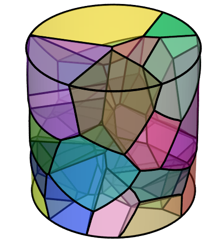
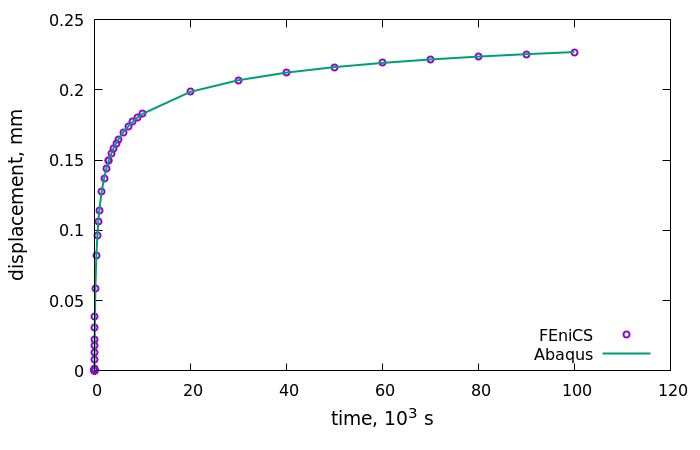
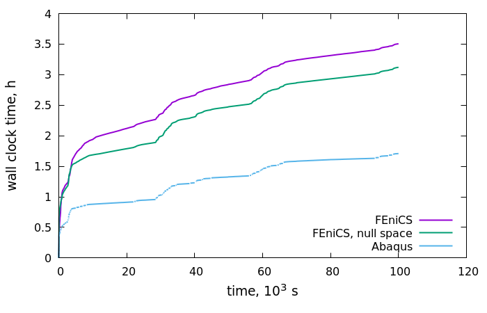

Polycrystal aggregate
=====================

Introduction
-----------------
The polycrystal aggregate was created by the `Neper <https://neper.info/>`_ software and using the output format adopted for the Abaqus software. The tessellation of a cylinder sample is visualized below
 

The sample contains 25 grains with various orientations. The following data (in Abaqus format) are used for the simulations:

+ `64_orientations.inp`: a list of 64 random crystalographic orientations. The first 25 orientations are taken for the simulation. Note the Abaqus definition of the orientations by specifiying certain points in the local coordinate system (see the Abaqus manual for details);   
+ `64_solidsections.inp`: defines the solid sections (grains) by assignment the respective element sets, the constitutive model and the orientations;
+ `64_surface.inp`: contains surfaces (Neper output);
+ `grains.inp`: Abaqus input file created based on the Neper output (nodes, elements and their sets) and extended to specify the initial and boundary conditions, and the output fields;
+ `abaqusTimes.txt`: the file contains the time increments generated during the Abaqus execution of the `grains.inp` job. Following the same time increments, the solution obtained by FEniCS can be compared with that of the Abaqus analysis.

The model does not include cohesive zone elements. The constitutive response of the individual grains is reproduced by the crystallographic creep model `SDCRCRY` from `labtools`. This model is a simplified version of the viscoplastic crystalographic model of `Meric et al., 1991 <https://doi.org/10.1115/1.2903374>`_. A fcc crystal is assumed to deform due to slip over twelve octahedral slips systems ({111} slip planes and [011] slip directions, denoted further as :math:`g \in [1,\ldots,12]`). The kinematic hardening is omitted, which is an appropiate simplification for monotone loadings, only isotropic hardenning is taken into account. The viscoplastic strain rate is driven by the resolved shear stresses :math:`\tau_g` in the slip systems ,..,

.. math::
   \dot {\mathbf{\varepsilon}}^{pl} = \frac{1}{2} \sum_{g=1}^{12} \left( \mathbf n_g \otimes \mathbf m_g + 
   \mathbf m_g \otimes \mathbf n_g \right) \cdot \dot \gamma_g, \\
   \dot \gamma_g = \dot \nu_g \textrm{sign}(\tau_g), \: \dot \nu_g = \left<\frac{ |\tau_g | - R_g |}{K} \right>^n, \\
   R_g = R_0 + Q \sum_{g=1}^{12} H_{gi}[1-\exp(-b \nu_i)],

where :math:`R_g` denotes the isotropic hardening in the slip system :math:`g`.
   
Implementation
--------------
Note the following code snippets. First, the Abaqus input file is read to get the nodes, elemets and the element sets:

.. code-block:: python

		# read mesh
		meshAba = meshio.read("grains.inp")

		# get nodes
		pointsAba = meshAba.points

		# get elements of a particular type and element sets
		elType = "tetra"
		elementsAba = meshAba.get_cells_type(elType)

		cell_setsAba = meshAba.cell_sets_dict

With the mesh editor :code:`editor = MeshEditor()` we add the nodes and elements into the FeniCS mesh:

.. code-block:: python

		# add nodes
		editor.init_vertices(pointsAba.shape[0])
		vertex = 0
		for node in pointsAba:
		    editor.add_vertex(vertex,node)
		    vertex += 1

		# add elements
		editor.init_cells(elementsAba.shape[0])
		cell = 0
		for element in elementsAba:
		    editor.add_cell(cell, element)
		    cell += 1

and use a mesh function to mark the elements wich belong to the same grain:

.. code-block:: python

		# introduce the grains into the mesh
		cell_domains = MeshFunction('size_t', mesh,mesh.topology().dim())
		cell_domains.set_all(0)

		grainID = 1
		for instance in cell_setsAba:
		    cellIDs = cell_setsAba[instance][elType]
		    if (instance in ElSetAllElements):
		        continue
        
		    for cellID in cellIDs:
		        cell_domains[cellID] = grainID
        
		    grainID += 1

The element sets associated with the grains are thus numerated by integers from 1 to 25. The
material laws and the crystallographic orientations must be assigned to the element sets. This is done
by the creation of the class :code:`ori = c.helper.OrientationFromAbaqus()` and reading the data regarding
the solid sections and the orientations from the Abaqus input files. Note that using the
`Euler angles <https://en.wikipedia.org/wiki/Euler_angles>`_ is a more common way for the definition of the
local (matrial) coordinate system. The computation of the Euler angles from the Abaqus orientations
happens within the orientation class, once the input data are completely read. This is checked by :code:`ori.isComplete()`. More details can be found in :ref:`reading orientations <target-orient>`.

The constitutive laws must be now created and assigned to each integratioon point. Each law needs the law name (currently implemented are an extended model of Chaboche `'SDCHABOX'` and the crystallographic creep model `'SDCRCRY'`), the constraint type (1D, plane strain/stress or the full 3D state) and optionally the cristalographic orientation given by the set of Euler angles :code:`law = c.Umat(law_name, constraint_type, euler_angles)`. The law name denotes the crystallograpohic model `SDCRCRY`. Because the integration points of the same grain get the same constitutive law, it makes sence to perform the assignment per each grain :code:`iploop.add_law(law, np.where(ip_flags == grainID)[0])`. Here :code:`ip_flags` marks the integration points within the element sets (grains) by the respsctive grain ID. The loop over the grains to assign the constitutive law is given as: 

.. code-block:: python

		# define constraint type & interpolation order
		constraint_type = c.Constraint.FULL
		prm = c.Parameters(constraint_type)
		prm.deg_d = 1   # if not given, quadrature order prm.deg_q = 2

		# get the array of all ips, with a marker from cell_domains
		ip_flags = get_ip_flags(mesh, prm, cell_domains)

		# create and fill IpLoop()
		iploop = c.IpLoop()
		grainID = 1
		for instance in cell_setsAba:
		    if (instance in ElSetAllElements):
		        continue
		    law_name = ori.solid_section_data[instance][0]
		    grain_orientation = ori.solid_section_data[instance][1]
		    euler_angles = ori.orientation_data_Euler[grain_orientation]
    
		    # create law and add to iploop, with the ids of ips, where the
		    # law holds
		    law = c.Umat(law_name, constraint_type, euler_angles)
		    iploop.add_law(law, np.where(ip_flags == grainID)[0])
    
		    grainID += 1

		# define problem, need a "template" law, which will be ommited
		problem = c.MechanicsProblem(mesh, prm, law, iploop)

The last line creates the mechanical problem, that is the weak formulation of the global equlibrium. The vertical displacements are constrained on the bottom base of the cylinder :code:`problem.set_bcs(bcs)`, and a traction vector is applied on the top base :code:`problem.add_force_term(dot(TestFunction(problem.Vd), Dforce)*ds(1))`. The load increases linearly till the :code:`CreepLoad` is achieved, and is kept constant. The time incrementation :code:`T = get_abaqus_times()` is taken from the respective simulation by Abaqus, where an automatic incrementation strategy was used.

Results
-------
The results obtained for the displacement on a prescribed node on the top base are identical for the Abaqus and FEniCS solutions. The computation on FEniCS lasts however about three times longer. 

The computations were carried out on a single CPU.

TODO
----

+ mention the computer properties
+ provide a link to the docu file for labtools in readme.md

